Breast Cancer Prediction
================
134780 Trevor Okinda
2024

- [Student Details](#student-details)
- [Setup Chunk](#setup-chunk)
  - [Source:](#source)
  - [Reference:](#reference)
- [Understanding the Dataset (Exploratory Data Analysis
  (EDA))](#understanding-the-dataset-exploratory-data-analysis-eda)
  - [Loading dataset](#loading-dataset)
  - [Measures of Frequency](#measures-of-frequency)
  - [Measures of Central Tendency](#measures-of-central-tendency)
  - [Measures of Distribution](#measures-of-distribution)
  - [Measures of Relationship](#measures-of-relationship)
  - [ANOVA](#anova)
  - [Plots](#plots)
- [Preprocessing and Data
  Transformation](#preprocessing-and-data-transformation)
  - [Missing Values](#missing-values)
- [Training Model](#training-model)
  - [Data Splitting](#data-splitting)
  - [Bootstrapping](#bootstrapping)
  - [Cross-validation](#cross-validation)
- [Model Training](#model-training)
- [Saving Model](#saving-model)

# Student Details

|                       |                          |
|-----------------------|--------------------------|
| **Student ID Number** | 134780                   |
| **Student Name**      | Trevor Okinda            |
| **BBIT 4.2 Group**    | C                        |
| **Project Name**      | Breast Cancer Prediction |

# Setup Chunk

**Note:** the following KnitR options have been set as the global
defaults: <BR>
`knitr::opts_chunk$set(echo = TRUE, warning = FALSE, eval = TRUE, collapse = FALSE, tidy = TRUE)`.

More KnitR options are documented here
<https://bookdown.org/yihui/rmarkdown-cookbook/chunk-options.html> and
here <https://yihui.org/knitr/options/>.

### Source:

The dataset that was used can be downloaded here: *\<<a
href="https://www.kaggle.com/datasets/merishnasuwal/breast-cancer-prediction-dataset\"
class="uri">https://www.kaggle.com/datasets/merishnasuwal/breast-cancer-prediction-dataset\</a>\>*

### Reference:

*\<merishnasuwal. (n.d.). Breast Cancer Prediction Dataset. Kaggle.
Retrieved April 17, 2025, from <a
href="https://www.kaggle.com/datasets/merishnasuwal/breast-cancer-prediction-dataset\"
class="uri">https://www.kaggle.com/datasets/merishnasuwal/breast-cancer-prediction-dataset\</a>\>  
Refer to the APA 7th edition manual for rules on how to cite datasets:
<https://apastyle.apa.org/style-grammar-guidelines/references/examples/data-set-references>*

# Understanding the Dataset (Exploratory Data Analysis (EDA))

## Loading dataset

``` r
# Load dataset
breast_cancer_data <- read.csv("Breast_cancer_data.csv", colClasses = c(
  mean_radius = "numeric",
  mean_texture = "numeric",
  mean_perimeter = "numeric",
  mean_area = "numeric",
  mean_smoothness = "numeric",
  diagnosis = "factor"
))

# Display the structure of the dataset
str(breast_cancer_data)
```

    ## 'data.frame':    569 obs. of  6 variables:
    ##  $ mean_radius    : num  18 20.6 19.7 11.4 20.3 ...
    ##  $ mean_texture   : num  10.4 17.8 21.2 20.4 14.3 ...
    ##  $ mean_perimeter : num  122.8 132.9 130 77.6 135.1 ...
    ##  $ mean_area      : num  1001 1326 1203 386 1297 ...
    ##  $ mean_smoothness: num  0.1184 0.0847 0.1096 0.1425 0.1003 ...
    ##  $ diagnosis      : Factor w/ 2 levels "0","1": 1 1 1 1 1 1 1 1 1 1 ...

``` r
# View the first few rows of the dataset
head(breast_cancer_data)
```

    ##   mean_radius mean_texture mean_perimeter mean_area mean_smoothness diagnosis
    ## 1       17.99        10.38         122.80    1001.0         0.11840         0
    ## 2       20.57        17.77         132.90    1326.0         0.08474         0
    ## 3       19.69        21.25         130.00    1203.0         0.10960         0
    ## 4       11.42        20.38          77.58     386.1         0.14250         0
    ## 5       20.29        14.34         135.10    1297.0         0.10030         0
    ## 6       12.45        15.70          82.57     477.1         0.12780         0

``` r
# View the dataset in a separate viewer window
View(breast_cancer_data)
```

## Measures of Frequency

``` r
# Frequency distribution for the diagnosis
diagnosis_freq <- table(breast_cancer_data$diagnosis)
print(diagnosis_freq)
```

    ## 
    ##   0   1 
    ## 212 357

``` r
# Proportion of each class
diagnosis_prop <- prop.table(diagnosis_freq)
print(diagnosis_prop)
```

    ## 
    ##         0         1 
    ## 0.3725835 0.6274165

## Measures of Central Tendency

``` r
# Mean for numeric variables
mean_values <- sapply(breast_cancer_data[, 1:5], mean)
print(mean_values)
```

    ##     mean_radius    mean_texture  mean_perimeter       mean_area mean_smoothness 
    ##     14.12729174     19.28964851     91.96903339    654.88910369      0.09636028

``` r
# Median for numeric variables
median_values <- sapply(breast_cancer_data[, 1:5], median)
print(median_values)
```

    ##     mean_radius    mean_texture  mean_perimeter       mean_area mean_smoothness 
    ##        13.37000        18.84000        86.24000       551.10000         0.09587

``` r
# Mode function
get_mode <- function(v) {
  uniqv <- unique(v)
  uniqv[which.max(tabulate(match(v, uniqv)))]
}
```

## Measures of Distribution

``` r
# Since mode is not typically used for numeric variables in this context, we'll skip it for now.
# Variance for numeric variables
variance_values <- sapply(breast_cancer_data[, 1:5], var)
print(variance_values)
```

    ##     mean_radius    mean_texture  mean_perimeter       mean_area mean_smoothness 
    ##    1.241892e+01    1.849891e+01    5.904405e+02    1.238436e+05    1.977997e-04

``` r
# Standard deviation for numeric variables
sd_values <- sapply(breast_cancer_data[, 1:5], sd)
print(sd_values)
```

    ##     mean_radius    mean_texture  mean_perimeter       mean_area mean_smoothness 
    ##      3.52404883      4.30103577     24.29898104    351.91412918      0.01406413

``` r
# Skewness and kurtosis require the 'moments' package
library(moments)

# Skewness for numeric variables
skewness_values <- sapply(breast_cancer_data[, 1:5], skewness)
print(skewness_values)
```

    ##     mean_radius    mean_texture  mean_perimeter       mean_area mean_smoothness 
    ##       0.9398934       0.6487336       0.9880370       1.6413905       0.4551199

``` r
# Kurtosis for numeric variables
kurtosis_values <- sapply(breast_cancer_data[, 1:5], kurtosis)
print(kurtosis_values)
```

    ##     mean_radius    mean_texture  mean_perimeter       mean_area mean_smoothness 
    ##        3.827584        3.741145        3.953165        6.609761        3.837945

## Measures of Relationship

``` r
# Correlation matrix for numeric variables
correlation_matrix <- cor(breast_cancer_data[, 1:5])
print(correlation_matrix)
```

    ##                 mean_radius mean_texture mean_perimeter mean_area
    ## mean_radius       1.0000000   0.32378189      0.9978553 0.9873572
    ## mean_texture      0.3237819   1.00000000      0.3295331 0.3210857
    ## mean_perimeter    0.9978553   0.32953306      1.0000000 0.9865068
    ## mean_area         0.9873572   0.32108570      0.9865068 1.0000000
    ## mean_smoothness   0.1705812  -0.02338852      0.2072782 0.1770284
    ##                 mean_smoothness
    ## mean_radius          0.17058119
    ## mean_texture        -0.02338852
    ## mean_perimeter       0.20727816
    ## mean_area            0.17702838
    ## mean_smoothness      1.00000000

``` r
# Scatter plot matrix
pairs(breast_cancer_data[, 1:5], main = "Scatterplot Matrix")
```

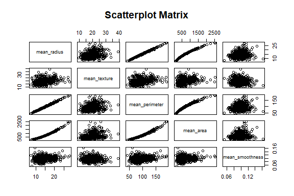<!-- -->

## ANOVA

``` r
# ANOVA for mean_radius
anova_mean_radius <- summary(aov(mean_radius ~ diagnosis, data = breast_cancer_data))
print(anova_mean_radius)
```

    ##              Df Sum Sq Mean Sq F value Pr(>F)    
    ## diagnosis     1   3759    3759     647 <2e-16 ***
    ## Residuals   567   3295       6                   
    ## ---
    ## Signif. codes:  0 '***' 0.001 '**' 0.01 '*' 0.05 '.' 0.1 ' ' 1

``` r
# ANOVA for mean_texture
anova_mean_texture <- summary(aov(mean_texture ~ diagnosis, data = breast_cancer_data))
print(anova_mean_texture)
```

    ##              Df Sum Sq Mean Sq F value Pr(>F)    
    ## diagnosis     1   1811  1811.2   118.1 <2e-16 ***
    ## Residuals   567   8696    15.3                   
    ## ---
    ## Signif. codes:  0 '***' 0.001 '**' 0.01 '*' 0.05 '.' 0.1 ' ' 1

``` r
# ANOVA for mean_perimeter
anova_mean_perimeter <- summary(aov(mean_perimeter ~ diagnosis, data = breast_cancer_data))
print(anova_mean_perimeter)
```

    ##              Df Sum Sq Mean Sq F value Pr(>F)    
    ## diagnosis     1 184959  184959   697.2 <2e-16 ***
    ## Residuals   567 150411     265                   
    ## ---
    ## Signif. codes:  0 '***' 0.001 '**' 0.01 '*' 0.05 '.' 0.1 ' ' 1

``` r
# ANOVA for mean_area
anova_mean_area <- summary(aov(mean_area ~ diagnosis, data = breast_cancer_data))
print(anova_mean_area)
```

    ##              Df   Sum Sq  Mean Sq F value Pr(>F)    
    ## diagnosis     1 35358547 35358547   573.1 <2e-16 ***
    ## Residuals   567 34984592    61701                   
    ## ---
    ## Signif. codes:  0 '***' 0.001 '**' 0.01 '*' 0.05 '.' 0.1 ' ' 1

``` r
# ANOVA for mean_smoothness
anova_mean_smoothness <- summary(aov(mean_smoothness ~ diagnosis, data = breast_cancer_data))
print(anova_mean_smoothness)
```

    ##              Df  Sum Sq  Mean Sq F value Pr(>F)    
    ## diagnosis     1 0.01444 0.014444   83.65 <2e-16 ***
    ## Residuals   567 0.09791 0.000173                   
    ## ---
    ## Signif. codes:  0 '***' 0.001 '**' 0.01 '*' 0.05 '.' 0.1 ' ' 1

## Plots

``` r
# Load ggplot2 for plotting
library(ggplot2)

# Create histograms for numeric variables
ggplot(breast_cancer_data, aes(x = mean_radius)) + 
  geom_histogram(binwidth = 1, fill = "blue", color = "black") +
  ggtitle("Histogram of Mean Radius")
```

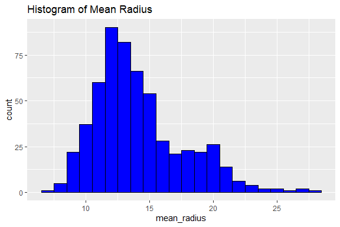<!-- -->

``` r
ggplot(breast_cancer_data, aes(x = mean_texture)) + 
  geom_histogram(binwidth = 1, fill = "blue", color = "black") +
  ggtitle("Histogram of Mean Texture")
```

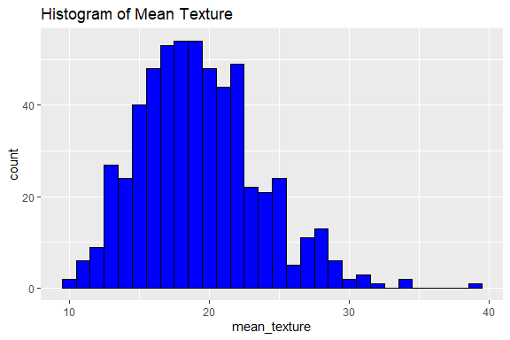<!-- -->

``` r
ggplot(breast_cancer_data, aes(x = mean_perimeter)) + 
  geom_histogram(binwidth = 5, fill = "blue", color = "black") +
  ggtitle("Histogram of Mean Perimeter")
```

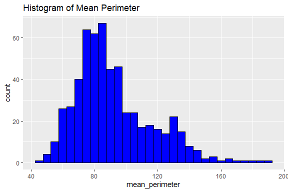<!-- -->

``` r
ggplot(breast_cancer_data, aes(x = mean_area)) + 
  geom_histogram(binwidth = 50, fill = "blue", color = "black") +
  ggtitle("Histogram of Mean Area")
```

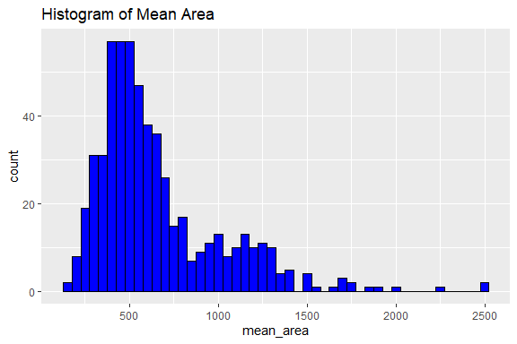<!-- -->

``` r
ggplot(breast_cancer_data, aes(x = mean_smoothness)) + 
  geom_histogram(binwidth = 0.01, fill = "blue", color = "black") +
  ggtitle("Histogram of Mean Smoothness")
```

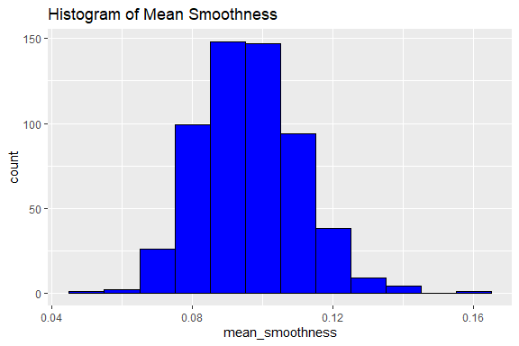<!-- -->

``` r
# Create box plots for numeric variables by diagnosis
ggplot(breast_cancer_data, aes(x = diagnosis, y = mean_radius, fill = diagnosis)) + 
  geom_boxplot() +
  ggtitle("Box Plot of Mean Radius by Diagnosis")
```

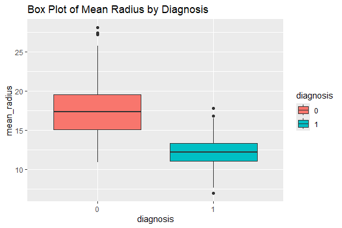<!-- -->

``` r
ggplot(breast_cancer_data, aes(x = diagnosis, y = mean_texture, fill = diagnosis)) + 
  geom_boxplot() +
  ggtitle("Box Plot of Mean Texture by Diagnosis")
```

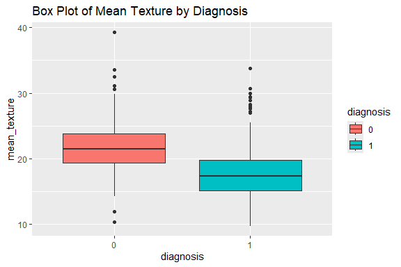<!-- -->

``` r
ggplot(breast_cancer_data, aes(x = diagnosis, y = mean_perimeter, fill = diagnosis)) + 
  geom_boxplot() +
  ggtitle("Box Plot of Mean Perimeter by Diagnosis")
```

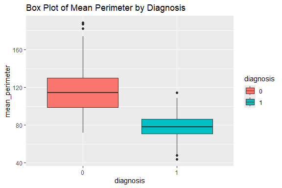<!-- -->

``` r
ggplot(breast_cancer_data, aes(x = diagnosis, y = mean_area, fill = diagnosis)) + 
  geom_boxplot() +
  ggtitle("Box Plot of Mean Area by Diagnosis")
```

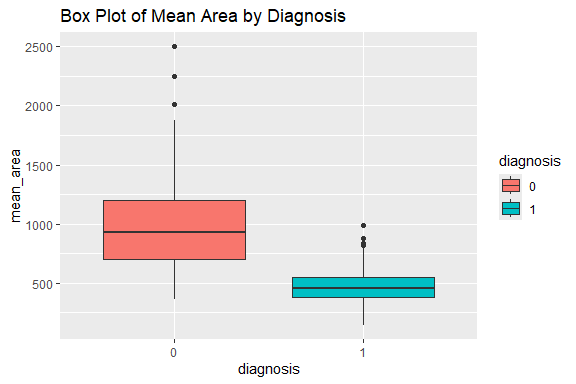<!-- -->

``` r
ggplot(breast_cancer_data, aes(x = diagnosis, y = mean_smoothness, fill = diagnosis)) + 
  geom_boxplot() +
  ggtitle("Box Plot of Mean Smoothness by Diagnosis")
```

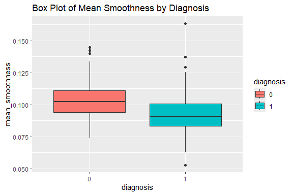<!-- -->

``` r
# Bar plot for the diagnosis variable
ggplot(breast_cancer_data, aes(x = diagnosis, fill = diagnosis)) + 
  geom_bar() +
  ggtitle("Bar Plot of Diagnosis")
```

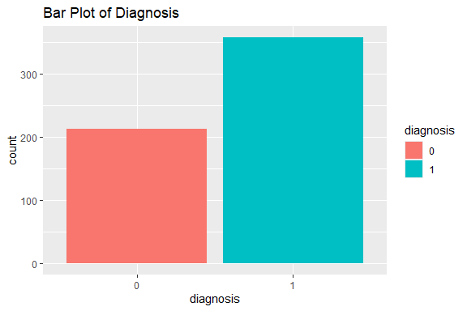<!-- -->

``` r
# Scatter plots colored by diagnosis
ggplot(breast_cancer_data, aes(x = mean_radius, y = mean_texture, color = diagnosis)) + 
  geom_point() +
  ggtitle("Scatter Plot of Mean Radius vs. Mean Texture")
```

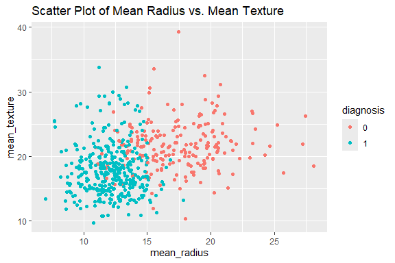<!-- -->

``` r
ggplot(breast_cancer_data, aes(x = mean_radius, y = mean_perimeter, color = diagnosis)) + 
  geom_point() +
  ggtitle("Scatter Plot of Mean Radius vs. Mean Perimeter")
```

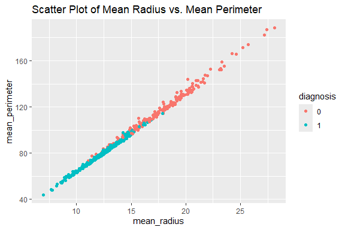<!-- -->

``` r
ggplot(breast_cancer_data, aes(x = mean_radius, y = mean_area, color = diagnosis)) + 
  geom_point() +
  ggtitle("Scatter Plot of Mean Radius vs. Mean Area")
```

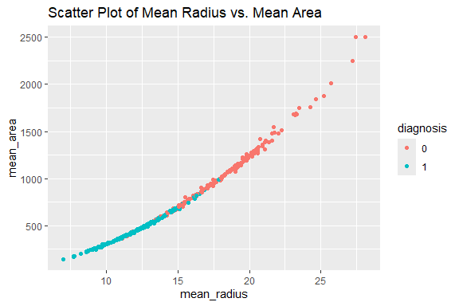<!-- -->

``` r
ggplot(breast_cancer_data, aes(x = mean_radius, y = mean_smoothness, color = diagnosis)) + 
  geom_point() +
  ggtitle("Scatter Plot of Mean Radius vs. Mean Smoothness")
```

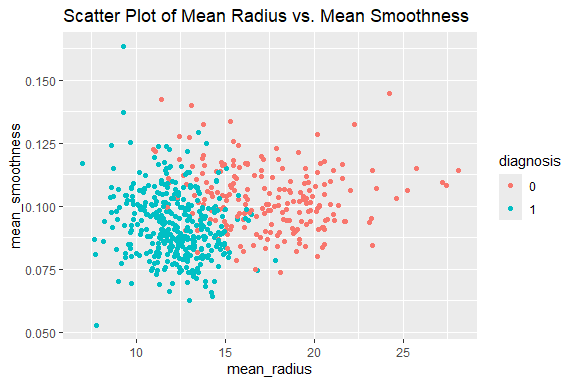<!-- -->

``` r
# Install and load GGally for pair plots
library(GGally)
```

    ## Registered S3 method overwritten by 'GGally':
    ##   method from   
    ##   +.gg   ggplot2

``` r
# Pair plot for numeric variables colored by diagnosis
ggpairs(breast_cancer_data, columns = 1:5, ggplot2::aes(color = diagnosis))
```

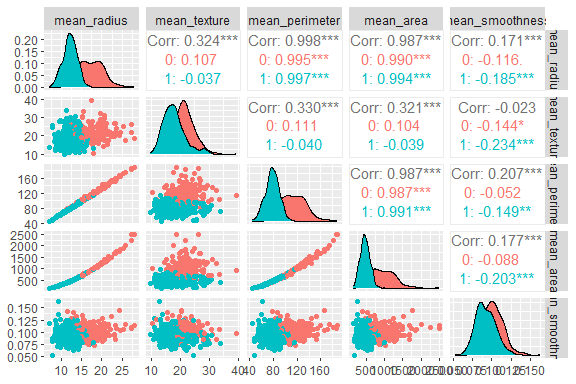<!-- -->

# Preprocessing and Data Transformation

## Missing Values

``` r
# Check for missing values in the entire dataset
total_missing_values <- sum(is.na(breast_cancer_data))
print(paste("Total missing values:", total_missing_values))
```

    ## [1] "Total missing values: 0"

``` r
# Install and load the VIM package
library(VIM)
```

    ## Loading required package: colorspace

    ## Loading required package: grid

    ## The legacy packages maptools, rgdal, and rgeos, underpinning the sp package,
    ## which was just loaded, will retire in October 2023.
    ## Please refer to R-spatial evolution reports for details, especially
    ## https://r-spatial.org/r/2023/05/15/evolution4.html.
    ## It may be desirable to make the sf package available;
    ## package maintainers should consider adding sf to Suggests:.
    ## The sp package is now running under evolution status 2
    ##      (status 2 uses the sf package in place of rgdal)

    ## VIM is ready to use.

    ## Suggestions and bug-reports can be submitted at: https://github.com/statistikat/VIM/issues

    ## 
    ## Attaching package: 'VIM'

    ## The following object is masked from 'package:datasets':
    ## 
    ##     sleep

``` r
# Plot missing data
aggr(breast_cancer_data, col = c('navyblue', 'red'), numbers = TRUE, sortVars = TRUE, labels = names(breast_cancer_data), cex.axis = .7, gap = 3, ylab = c("Missing data", "Pattern"))
```

<!-- -->

    ## 
    ##  Variables sorted by number of missings: 
    ##         Variable Count
    ##      mean_radius     0
    ##     mean_texture     0
    ##   mean_perimeter     0
    ##        mean_area     0
    ##  mean_smoothness     0
    ##        diagnosis     0

# Training Model

## Data Splitting

``` r
# Install and load the caTools package
library(caTools)

# Set seed for reproducibility
set.seed(123)

# Split the data into training (70%) and testing (30%) sets
split <- sample.split(breast_cancer_data$diagnosis, SplitRatio = 0.7)
training_set <- subset(breast_cancer_data, split == TRUE)
testing_set <- subset(breast_cancer_data, split == FALSE)

# Display the structure of the training and testing sets
str(training_set)
```

    ## 'data.frame':    398 obs. of  6 variables:
    ##  $ mean_radius    : num  18 19.7 12.4 18.2 13 ...
    ##  $ mean_texture   : num  10.4 21.2 15.7 20 21.8 ...
    ##  $ mean_perimeter : num  122.8 130 82.6 119.6 87.5 ...
    ##  $ mean_area      : num  1001 1203 477 1040 520 ...
    ##  $ mean_smoothness: num  0.1184 0.1096 0.1278 0.0946 0.1273 ...
    ##  $ diagnosis      : Factor w/ 2 levels "0","1": 1 1 1 1 1 1 1 1 1 1 ...

``` r
str(testing_set)
```

    ## 'data.frame':    171 obs. of  6 variables:
    ##  $ mean_radius    : num  20.6 11.4 20.3 13.7 16 ...
    ##  $ mean_texture   : num  17.8 20.4 14.3 20.8 23.2 ...
    ##  $ mean_perimeter : num  132.9 77.6 135.1 90.2 102.7 ...
    ##  $ mean_area      : num  1326 386 1297 578 798 ...
    ##  $ mean_smoothness: num  0.0847 0.1425 0.1003 0.1189 0.0821 ...
    ##  $ diagnosis      : Factor w/ 2 levels "0","1": 1 1 1 1 1 1 1 1 1 1 ...

``` r
dim(training_set)
```

    ## [1] 398   6

``` r
dim(testing_set)
```

    ## [1] 171   6

## Bootstrapping

``` r
# Install and load the boot package
library(boot)

# Define a function to compute the statistic of interest (mean in this case)
bootstrap_function <- function(data, indices) {
  d <- data[indices, ]  # allows boot to select sample
  return(mean(d$mean_radius))  # example statistic
}

# Apply bootstrapping
set.seed(123)
bootstrap_results <- boot(data = breast_cancer_data, statistic = bootstrap_function, R = 1000)

# Display bootstrapping results
print(bootstrap_results)
```

    ## 
    ## ORDINARY NONPARAMETRIC BOOTSTRAP
    ## 
    ## 
    ## Call:
    ## boot(data = breast_cancer_data, statistic = bootstrap_function, 
    ##     R = 1000)
    ## 
    ## 
    ## Bootstrap Statistics :
    ##     original       bias    std. error
    ## t1* 14.12729 -0.006225895    0.142184

``` r
plot(bootstrap_results)
```

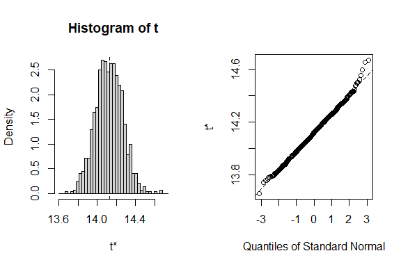<!-- -->

## Cross-validation

``` r
# Install and load the caret package
library(caret)
```

    ## Loading required package: lattice

    ## 
    ## Attaching package: 'lattice'

    ## The following object is masked from 'package:boot':
    ## 
    ##     melanoma

``` r
# Set up cross-validation
train_control <- trainControl(method = "cv", number = 10)

# Train a model using cross-validation (example with logistic regression)
set.seed(123)
model <- train(diagnosis ~ mean_radius + mean_texture + mean_perimeter + mean_area + mean_smoothness,
               data = training_set,
               method = "glm",
               family = binomial,
               trControl = train_control)

# Print the model summary
print(model)
```

    ## Generalized Linear Model 
    ## 
    ## 398 samples
    ##   5 predictor
    ##   2 classes: '0', '1' 
    ## 
    ## No pre-processing
    ## Resampling: Cross-Validated (10 fold) 
    ## Summary of sample sizes: 358, 358, 358, 358, 358, 359, ... 
    ## Resampling results:
    ## 
    ##   Accuracy   Kappa    
    ##   0.9196795  0.8272571

``` r
# Make predictions on the testing set
predictions <- predict(model, newdata = testing_set)

# Evaluate the model's performance
confusion_matrix <- confusionMatrix(predictions, testing_set$diagnosis)
print(confusion_matrix)
```

    ## Confusion Matrix and Statistics
    ## 
    ##           Reference
    ## Prediction   0   1
    ##          0  57   3
    ##          1   7 104
    ##                                           
    ##                Accuracy : 0.9415          
    ##                  95% CI : (0.8951, 0.9716)
    ##     No Information Rate : 0.6257          
    ##     P-Value [Acc > NIR] : <2e-16          
    ##                                           
    ##                   Kappa : 0.8736          
    ##                                           
    ##  Mcnemar's Test P-Value : 0.3428          
    ##                                           
    ##             Sensitivity : 0.8906          
    ##             Specificity : 0.9720          
    ##          Pos Pred Value : 0.9500          
    ##          Neg Pred Value : 0.9369          
    ##              Prevalence : 0.3743          
    ##          Detection Rate : 0.3333          
    ##    Detection Prevalence : 0.3509          
    ##       Balanced Accuracy : 0.9313          
    ##                                           
    ##        'Positive' Class : 0               
    ## 

# Model Training

``` r
# Model Training

# Generalized Linear Model (GLM)
# Install and load the caret package
library(caret)

# Train a GLM model
set.seed(123)
glm_model <- train(diagnosis ~ mean_radius + mean_texture + mean_perimeter + mean_area + mean_smoothness,
                   data = training_set,
                   method = "glm",
                   family = binomial,
                   trControl = trainControl(method = "cv", number = 10))

# Print the GLM model summary
print(glm_model)
```

    ## Generalized Linear Model 
    ## 
    ## 398 samples
    ##   5 predictor
    ##   2 classes: '0', '1' 
    ## 
    ## No pre-processing
    ## Resampling: Cross-Validated (10 fold) 
    ## Summary of sample sizes: 358, 358, 358, 358, 358, 359, ... 
    ## Resampling results:
    ## 
    ##   Accuracy   Kappa    
    ##   0.9196795  0.8272571

``` r
# Make predictions on the testing set
glm_predictions <- predict(glm_model, newdata = testing_set)

# Evaluate the GLM model's performance
glm_confusion_matrix <- confusionMatrix(glm_predictions, testing_set$diagnosis)
print(glm_confusion_matrix)
```

    ## Confusion Matrix and Statistics
    ## 
    ##           Reference
    ## Prediction   0   1
    ##          0  57   3
    ##          1   7 104
    ##                                           
    ##                Accuracy : 0.9415          
    ##                  95% CI : (0.8951, 0.9716)
    ##     No Information Rate : 0.6257          
    ##     P-Value [Acc > NIR] : <2e-16          
    ##                                           
    ##                   Kappa : 0.8736          
    ##                                           
    ##  Mcnemar's Test P-Value : 0.3428          
    ##                                           
    ##             Sensitivity : 0.8906          
    ##             Specificity : 0.9720          
    ##          Pos Pred Value : 0.9500          
    ##          Neg Pred Value : 0.9369          
    ##              Prevalence : 0.3743          
    ##          Detection Rate : 0.3333          
    ##    Detection Prevalence : 0.3509          
    ##       Balanced Accuracy : 0.9313          
    ##                                           
    ##        'Positive' Class : 0               
    ## 

``` r
# Support Vector Machine (SVM)
# Install and load the e1071 package for SVM
library(e1071)
```

    ## 
    ## Attaching package: 'e1071'

    ## The following objects are masked from 'package:moments':
    ## 
    ##     kurtosis, moment, skewness

``` r
# Train a SVM model
set.seed(123)
svm_model <- train(diagnosis ~ mean_radius + mean_texture + mean_perimeter + mean_area + mean_smoothness,
                   data = training_set,
                   method = "svmLinear",
                   trControl = trainControl(method = "cv", number = 10))

# Print the SVM model summary
print(svm_model)
```

    ## Support Vector Machines with Linear Kernel 
    ## 
    ## 398 samples
    ##   5 predictor
    ##   2 classes: '0', '1' 
    ## 
    ## No pre-processing
    ## Resampling: Cross-Validated (10 fold) 
    ## Summary of sample sizes: 358, 358, 358, 358, 358, 359, ... 
    ## Resampling results:
    ## 
    ##   Accuracy   Kappa    
    ##   0.9297436  0.8480323
    ## 
    ## Tuning parameter 'C' was held constant at a value of 1

``` r
# Make predictions on the testing set
svm_predictions <- predict(svm_model, newdata = testing_set)

# Evaluate the SVM model's performance
svm_confusion_matrix <- confusionMatrix(svm_predictions, testing_set$diagnosis)
print(svm_confusion_matrix)
```

    ## Confusion Matrix and Statistics
    ## 
    ##           Reference
    ## Prediction   0   1
    ##          0  58   5
    ##          1   6 102
    ##                                           
    ##                Accuracy : 0.9357          
    ##                  95% CI : (0.8878, 0.9675)
    ##     No Information Rate : 0.6257          
    ##     P-Value [Acc > NIR] : <2e-16          
    ##                                           
    ##                   Kappa : 0.8622          
    ##                                           
    ##  Mcnemar's Test P-Value : 1               
    ##                                           
    ##             Sensitivity : 0.9062          
    ##             Specificity : 0.9533          
    ##          Pos Pred Value : 0.9206          
    ##          Neg Pred Value : 0.9444          
    ##              Prevalence : 0.3743          
    ##          Detection Rate : 0.3392          
    ##    Detection Prevalence : 0.3684          
    ##       Balanced Accuracy : 0.9298          
    ##                                           
    ##        'Positive' Class : 0               
    ## 

``` r
# Principal Component Analysis (PCA) with Logistic Regression
# Perform PCA
pca <- prcomp(training_set[, 1:5], center = TRUE, scale. = TRUE)

# Print the summary of PCA
summary(pca)
```

    ## Importance of components:
    ##                           PC1    PC2    PC3     PC4     PC5
    ## Standard deviation     1.7823 1.0147 0.8812 0.12601 0.03655
    ## Proportion of Variance 0.6353 0.2059 0.1553 0.00318 0.00027
    ## Cumulative Proportion  0.6353 0.8412 0.9966 0.99973 1.00000

``` r
# Add the PCA results to the training and testing sets
training_set_pca <- as.data.frame(predict(pca, training_set[, 1:5]))
training_set_pca$diagnosis <- training_set$diagnosis

testing_set_pca <- as.data.frame(predict(pca, testing_set[, 1:5]))
testing_set_pca$diagnosis <- testing_set$diagnosis

# Train a logistic regression model on the PCA components
set.seed(123)
pca_glm_model <- train(diagnosis ~ PC1 + PC2 + PC3 + PC4 + PC5,
                       data = training_set_pca,
                       method = "glm",
                       family = binomial,
                       trControl = trainControl(method = "cv", number = 10))

# Print the PCA-GLM model summary
print(pca_glm_model)
```

    ## Generalized Linear Model 
    ## 
    ## 398 samples
    ##   5 predictor
    ##   2 classes: '0', '1' 
    ## 
    ## No pre-processing
    ## Resampling: Cross-Validated (10 fold) 
    ## Summary of sample sizes: 358, 358, 358, 358, 358, 359, ... 
    ## Resampling results:
    ## 
    ##   Accuracy   Kappa    
    ##   0.9196795  0.8272571

``` r
# Make predictions on the testing set using the PCA components
pca_glm_predictions <- predict(pca_glm_model, newdata = testing_set_pca)

# Evaluate the PCA-GLM model's performance
pca_glm_confusion_matrix <- confusionMatrix(pca_glm_predictions, testing_set_pca$diagnosis)
print(pca_glm_confusion_matrix)
```

    ## Confusion Matrix and Statistics
    ## 
    ##           Reference
    ## Prediction   0   1
    ##          0  57   3
    ##          1   7 104
    ##                                           
    ##                Accuracy : 0.9415          
    ##                  95% CI : (0.8951, 0.9716)
    ##     No Information Rate : 0.6257          
    ##     P-Value [Acc > NIR] : <2e-16          
    ##                                           
    ##                   Kappa : 0.8736          
    ##                                           
    ##  Mcnemar's Test P-Value : 0.3428          
    ##                                           
    ##             Sensitivity : 0.8906          
    ##             Specificity : 0.9720          
    ##          Pos Pred Value : 0.9500          
    ##          Neg Pred Value : 0.9369          
    ##              Prevalence : 0.3743          
    ##          Detection Rate : 0.3333          
    ##    Detection Prevalence : 0.3509          
    ##       Balanced Accuracy : 0.9313          
    ##                                           
    ##        'Positive' Class : 0               
    ## 

# Saving Model

``` r
# Load the saved SVM model
loaded_model_svm <- readRDS("./models/svm_model.rds")

# Prepare new data for prediction
new_data <- data.frame(
  mean_radius = 17.99,
  mean_texture = 10.38,
  mean_perimeter = 122.8,
  mean_area = 1001,
  mean_smoothness = 0.1184
)

# Use the loaded model to make predictions for new data
predictions_loaded_model <- predict(loaded_model_svm, newdata = new_data)

# Print predictions
print(predictions_loaded_model)
```

    ## [1] 0
    ## Levels: 0 1
